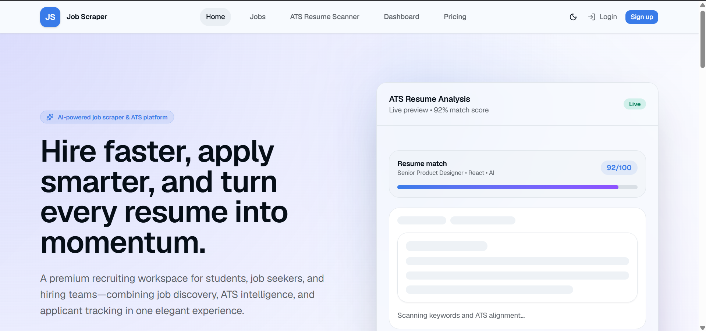
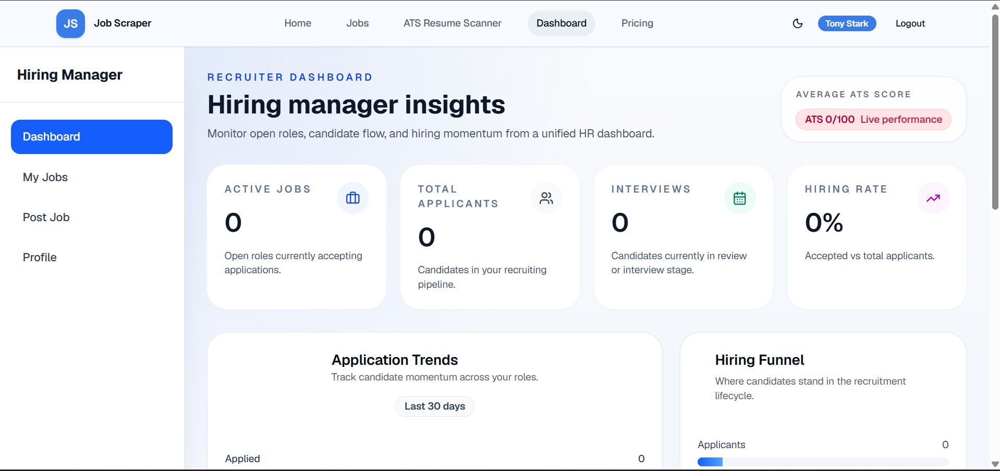
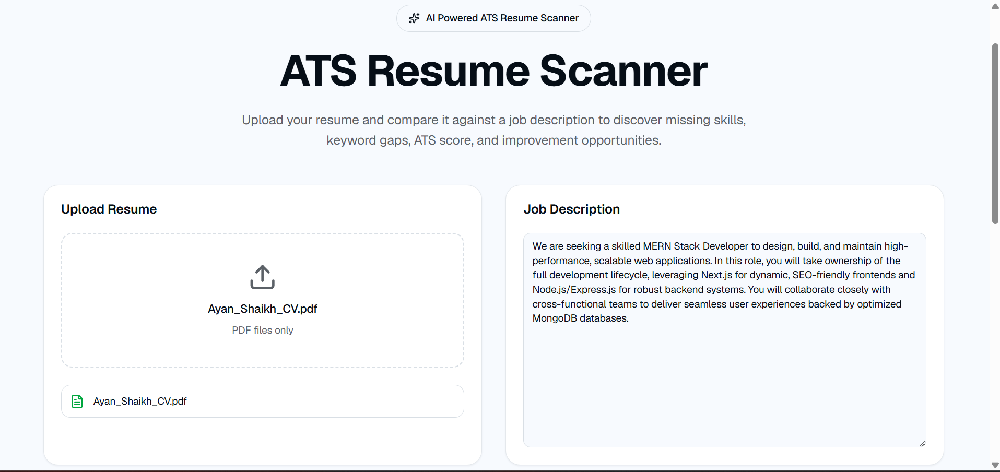
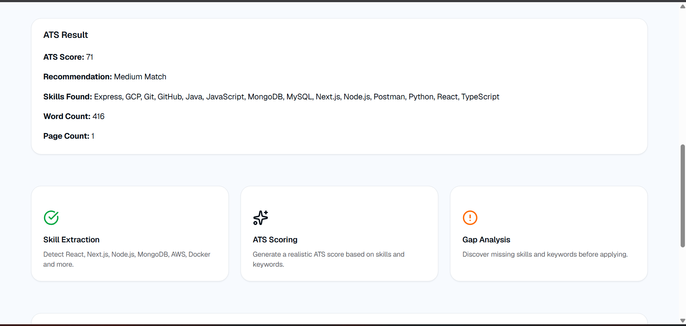
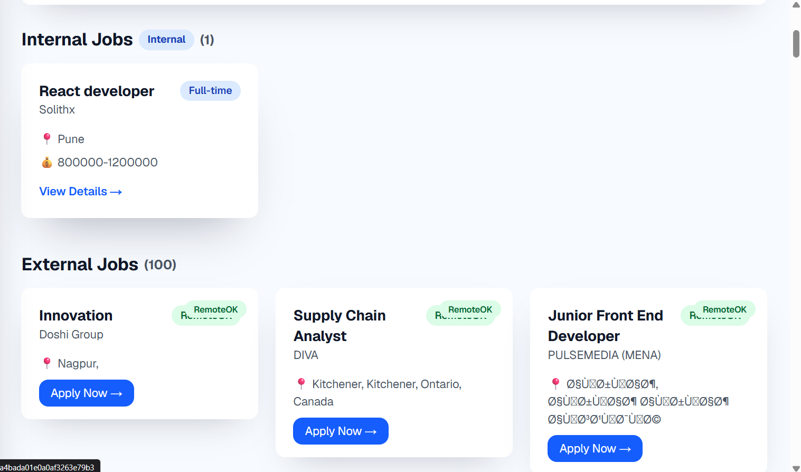
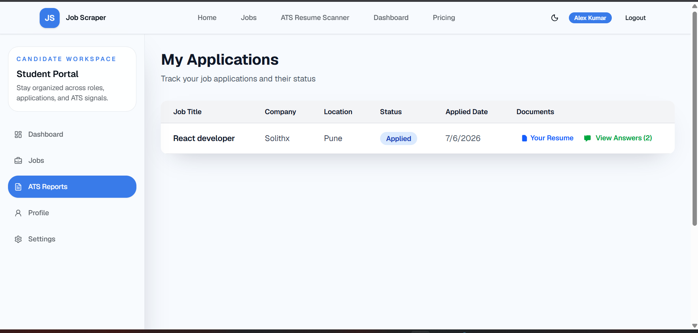
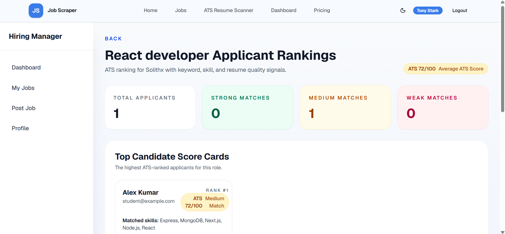

# Job Scraper Platform

A full-stack Job Scraper and Applicant Tracking System (ATS) built with Next.js, Node.js, Express, and MongoDB Atlas. The platform provides role-based access for Students and Hiring Managers, supporting job posting, application tracking, resume analysis, ATS scoring, and applicant management.

---

## Table of Contents

- [Overview](#overview)
- [Screenshots](#screenshots)
- [Features](#features)
- [Tech Stack](#tech-stack)
- [Getting Started](#getting-started)
- [Environment Variables](#environment-variables)
- [User Roles](#user-roles)
- [Test Credentials](#test-credentials)
- [Usage Guide](#usage-guide)
- [License](#license)

---

## Overview

The Job Scraper Platform connects students looking for opportunities with hiring managers looking to fill them. Students can browse jobs from both internal postings and external sources (RemoteOK), apply directly through the platform, and use a built-in ATS Resume Scanner to check how well their resume matches a job description. Hiring managers can post jobs, add screening questions, and review applicants along with their resumes and answers.

**Live Links**

- Frontend: [job-scraper-frontend-orcin.vercel.app](https://job-scraper-frontend-orcin.vercel.app/)
- Backend API: [job-scraper-backend-fju3.onrender.com](https://job-scraper-backend-fju3.onrender.com)
- Frontend Repository: [GitHub](https://github.com/Ayanshaikh313/Job_Scraper_frontend)
- Backend Repository: [GitHub](https://github.com/Ayanshaikh313/Job_Scraper_backend)

---

## Screenshots

**Homepage**


**Hiring Manager Dashboard**


**ATS Resume Scanner — Upload**


**ATS Resume Scanner — Result**


**Job Listings**


**Student Applications**


**Applicant Rankings**


---

## Features

### Student

- Register and log in
- View and update profile
- Browse internal job postings
- Browse external jobs aggregated from RemoteOK
- Search jobs by keyword
- View detailed job descriptions
- Apply to jobs and upload a resume (PDF)
- View application history and submitted answers
- Run resumes through the ATS Resume Scanner for scoring, skill extraction, and gap analysis

### Hiring Manager

- Register and log in
- View and update profile
- Create, edit, and delete job postings
- Add custom screening questions to job postings
- View applicants for each job
- Review submitted resumes and screening question answers
- Update applicant status through the hiring pipeline

Application status moves through the following stages:

```
Applied → Reviewing → Accepted / Rejected
```

---

## Tech Stack

**Frontend**
Next.js, TypeScript, Tailwind CSS, React, Shadcn UI Components, Lucide React, React Toastify

**Backend**
Node.js, Express.js

**Database**
MongoDB Atlas with Mongoose

**Authentication**
JWT-based authentication with bcrypt password hashing

**File Uploads**
Multer with local file storage

**Deployment**
Frontend on Vercel, backend on Render

---

## Getting Started

The frontend and backend are maintained as two separate repositories.

**Backend**

```bash
git clone https://github.com/Ayanshaikh313/Job_Scraper_backend.git
cd Job_Scraper_backend
npm install
npm start
```

The backend runs on `http://localhost:5000`.

**Frontend**

```bash
git clone https://github.com/Ayanshaikh313/Job_Scraper_frontend.git
cd Job_Scraper_frontend
npm install
npm run dev
```

The frontend runs on `http://localhost:3000`.

---

## Environment Variables

**Backend (`.env`)**

```env
PORT=5000
MONGODB_URI=your_mongodb_connection_string
JWT_SECRET=your_jwt_secret
JWT_EXPIRE=7d
```

**Frontend (`.env`)**

```env
NEXT_PUBLIC_API_URL=http://localhost:5000/api
```

---

## User Roles

The platform supports two roles, assigned at registration:

- **Student** — can browse and apply to jobs, and use the ATS resume scanner
- **Hiring Manager** — can create and manage job postings and review applicants

---

## Test Credentials

Use the following accounts to log in and test both roles of the platform.

**Student Account**

```
Email: student@example.com
Password: Student@123
```

**Hiring Manager Account**

```
Email: manager@example.com
Password: Manager@123
```

---

## Usage Guide

1. Register as either a Student or a Hiring Manager, or log in using the test credentials above.
2. As a Student, browse internal and external job listings, apply to jobs, and upload your resume. Use the ATS Resume Scanner to check your resume against a job description and see your ATS score, matched skills, and improvement suggestions.
3. As a Hiring Manager, create a job posting with optional screening questions, then review incoming applications, view resumes and answers, and update each applicant's status.

---

## License

This project is open source and available for personal or educational use.